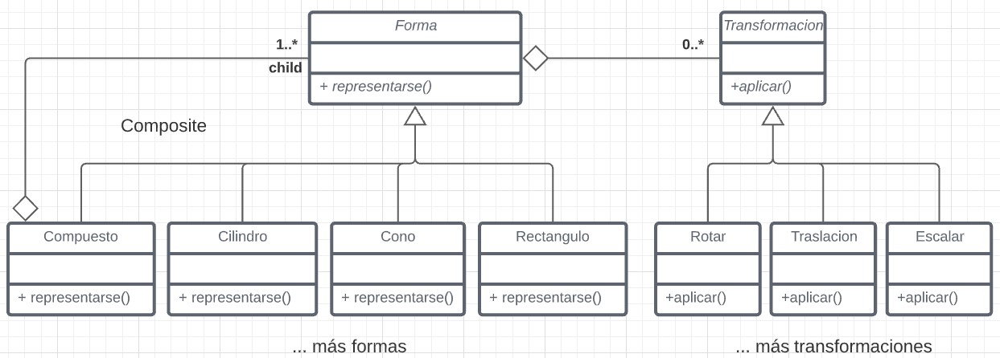

# Ejercicio Sistema Grafico
En sistemas gráficos se transforman y ensamblan figuras primitivas para producir figuras más complejas. Este proceso se repite hasta obtener la escena deseada, produciendo una estructura llamada grafo de escena.

Por ejemplo, se puede producir un árbol a partir de un cilindro, un cono, y operaciones de traslación, y luego producir un bosque usando el árbol, operaciones de escalado y traslación.

Ciertas transformaciones son constantes en el tiempo, mientras que otras dependen de parámetros externos como modificaciones por el diseñador, estado de alguna simulación, paso del tiempo, etc. Para simplificar estas modificaciones, las transformaciones se especifican sobre cualquier tipo de figura, en el nivel del grafo donde más sentido tienen, y aplican sobre todos los componentes de la figura.

Una vez fijada una escena a renderizar, se obtienen las primitivas que la componen, recorriendo el grafo completo y extrayendo las primitivas junto a la transformación compuesta aplicable a cada una de ellas.
Cada transformación se representa como una matriz de 3x3 o 4x4, y su composición es un producto de matrices, por lo que no es necesario escatimar en la cantidad de transformaciones representadas durante un recorrido.

## Resolución

Para resolver el problema propuesto se opto por utilizar el patron Composite. 
Esto nos permite trabajar de forma más uniforme sobre si es un conjunto de entidades
o una sola entidad lo que queremos representar.

A continuación se puede ver un diagrama de clases donde se ve esto.

Cada forma nueva que se quiera agregar debería de implementar la interfaz de 'Forma'
para que se representen y tener sus propias transformaciones.
Si se quieren agregar transformaciones es solamente agregarlas implementando 'Transformación'

La clave que permite trabajar con muchos elementos a la vez, es el objeto 
Compuesto. Con este se puede trabajar con multiples elementos y aplicarles las transformaciones.

El ejemplo dado del sistema solar seria como sigue:

* SistemaSolar: Compuesto, tiene al Sol  y al SistemaTierraLuna 
* Sol: Esfera (nueva Forma)
* SistemaTierraLuna: Compuesto, tiene a la Tierra y a la Luna. Se aplica una transformación de Traslación y Rotación
* Tierra: Esfera
* Luna: Esfera. Se aplica una transformación de Traslación y Rotación

# Ejercicio Calculadora
 Analizar que patrones se aplicaron sobre la implementación que realizaron
 de la calculadora en su variante orientada o objetos o en su variante funcional
 
 ## Resolución
 * Se tiene un Facade en lo que es el manejo del estado. Para acceder usamos los `selectors`, se despachan las acciones y se dirigen a los `reducers`
 * Se implementó en funcional el envió de las operaciones que podía realizar la calculadora. Llevándolo a objetos esto puede verse como el patron Command, lo que permite independizarnos de que acción es la que se está realizando.
 * Antes de realizar las operaciones enviadas, se tienen que llevar a cabo diferentes pasos. En este caso se utilizo el patron Template Method para volver generico el algoritmo. *(Guardar el estado, sacar del stack los números, realizar la operación, etc)*
 * Si bien no se implementó en la solución entregada, se podría haber usado el patron State para el manejo de los decimales. De esta forma se habría separado de mejor forma el código correspondiente a este apartado.