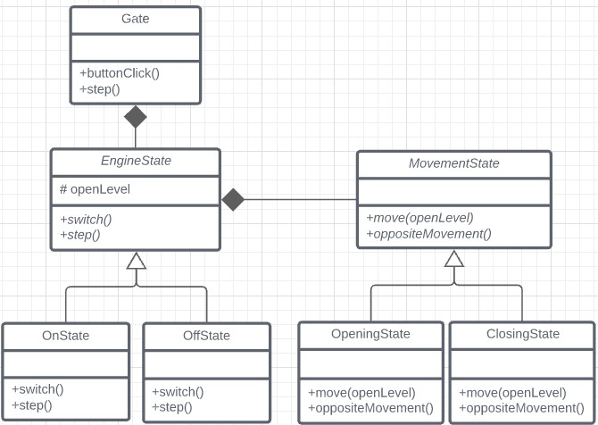
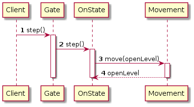

# Ejercicio
Se desea modelar el control remoto de un portón automático.
Lo que se tiene es la puerta o portón, que está conectada a un motor.
Cuando el motor arranca, hace mover la puerta.
Hay un control remoto de un solo botón, que al apretarlo controla el motor.
El mecanismo remoto se ignora para el ejercicio, suponiendo que la comunicación del botón a nuestro código ya está resuelta y recibimos una invocación cada vez que presiona el botón.

La lógica que se desea programar para el portón es la siguiente:

* Cuando se aprieta el botón, si la puerta está en movimiento se detiene, si está detenida se empieza a mover.
El sentido del movimiento se invierte al último que utilizó, cada vez que se va a comenzar a mover luego de detenerse. 

* El motor se detiene cuando la puerta se cerró completamente o se abrió completamente.

Se pide diseñar una solución para el mismo, con diagrama de clases, secuencia y los que sean necesarios para detallar la solución.

Implementar en TypeScript construyendo tests para diferentes escenarios:
Para el desarrollo y facilidad de testeo, supongamos que la puerta se cierra o abre completamente con 10 pasos de 10% de apertura cada uno. Agregar un método next o nextStep, que se usará manualmente, para simular el paso del tiempo para que el motor gire y la puerta abra ese 10%.

## Ejemplos: 
1. Puerta cerrada
2. Se presiona el botón, el motor arranca 
3. dado un STEP, la puerta está al 10% abierta
4. otro STEP la puerta está al 20%
5. otro STEP la puerta esta al 30%
6. Se presiona el botón, el motor se detiene, la puerta se detiene.
7. Se presiona el botón, el motor se arranca.
8. otro STEP la puerta está al 20% nuevamente ya que comenzó a cerrarse
9. otro STEP la puerta está al 10% 
10. otro STEP la puerta está Cerrada. El motor se detiene. 

* Puerta detenida, cerrada, se aprieta una vez, arranca a abrir. Estando abriendo se aprieta otra vez se detiene, se aprieta otra vez se empieza a cerrar, se aprieta otra vez se detiene, se aprieta otra vez se empieza a abrir.
* Puerta detenida abierta, se aprieta una vez, arranca a cerrar. Estando cerrando se aprieta otra vez se detiene, se aprieta otra vez se empieza a abrir, se aprieta otra vez se detiene, se aprieta otra vez se empieza a cerrar.

## Resolución
### Diagrama de clases del modelo propuesto

### Diagramas de secuencia

